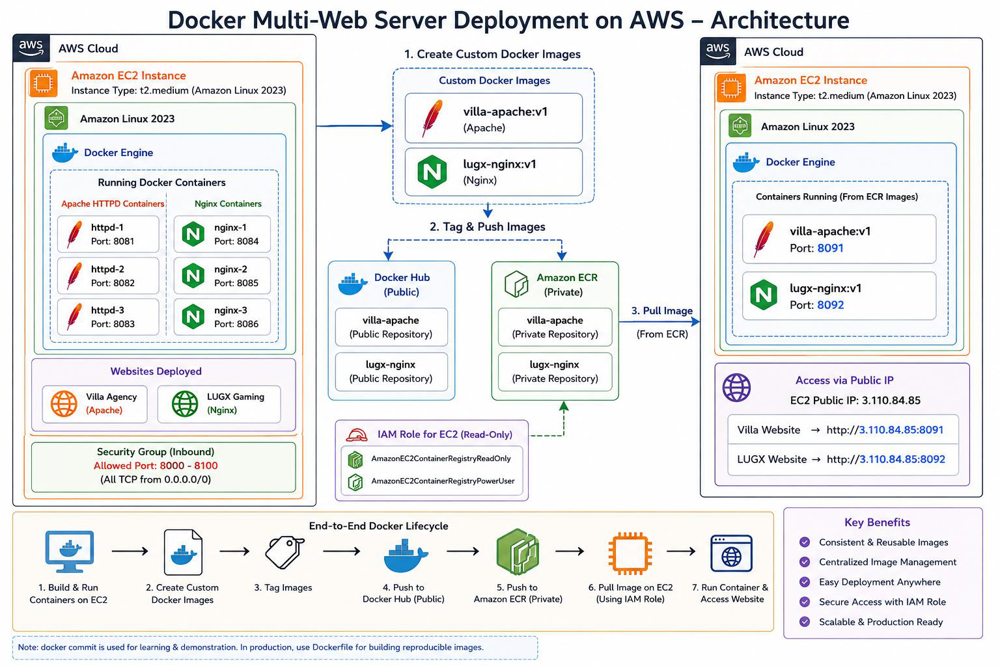
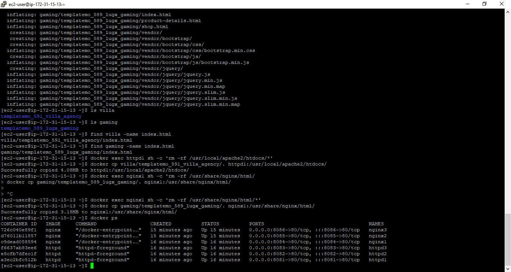
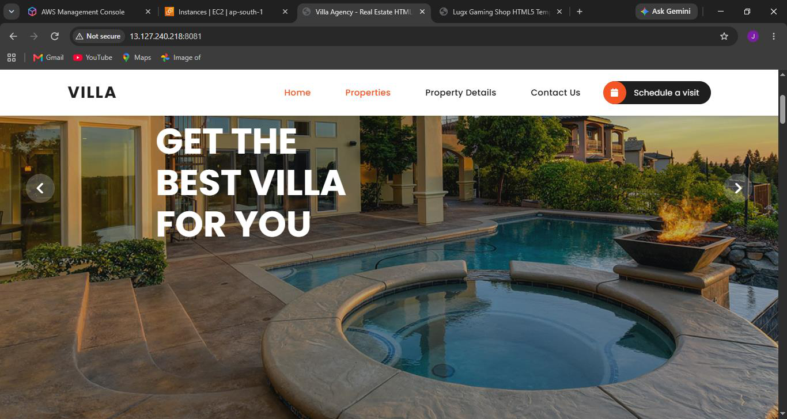
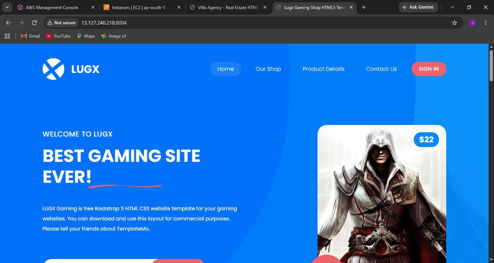
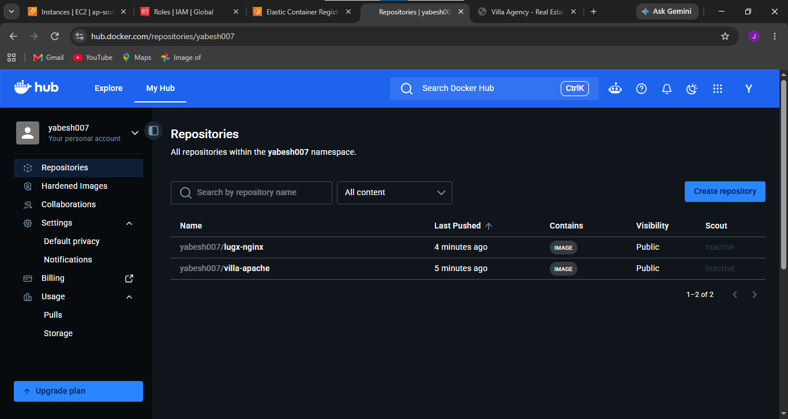
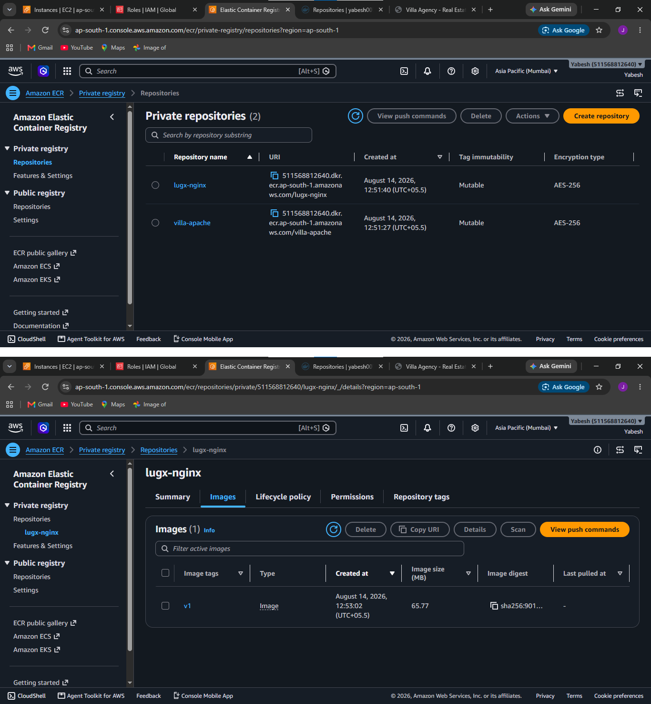
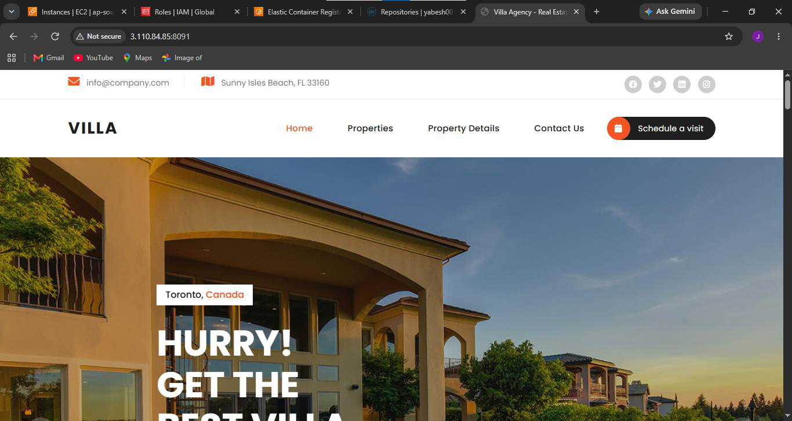

# AWS Docker Multi-Web Server Deployment

Hands-on containerization project deployed on Amazon EC2 using Docker, Apache HTTPD, Nginx, Docker Hub, and Amazon ECR.

This project demonstrates how multiple isolated web-server containers can run on a single EC2 instance, how custom container images can be created and versioned, and how those images can be published to both public and private container registries for reuse.

---

## Architecture



### Architecture Flow

```text
Users
  │
  ▼
Amazon EC2
Amazon Linux + Docker Engine
  │
  ├── httpd1 : 8081 → 80
  ├── httpd2 : 8082 → 80
  ├── httpd3 : 8083 → 80
  ├── nginx1 : 8084 → 80
  ├── nginx2 : 8085 → 80
  └── nginx3 : 8086 → 80
          │
          ▼
Configured Containers
          │
          │ docker commit
          ▼
Custom Docker Images
  ├── villa-apache:v1
  └── lugx-nginx:v1
          │
          ├──────────────► Docker Hub
          │
          └──────────────► Amazon ECR
                              │
                              ▼
                     Redeployed Container
                     ecr-villa-test :8091
```

---

## Project Overview

- Provisioned an Amazon Linux EC2 instance as the Docker host.
- Installed and configured Docker Engine.
- Deployed six independent web-server containers.
- Ran three Apache HTTPD containers and three Nginx containers.
- Used host-to-container port mapping so each server could be accessed independently.
- Deployed a Villa Agency website inside Apache.
- Deployed a LUGX Gaming website inside Nginx.
- Created reusable custom images from the configured containers.
- Tagged and pushed images to Docker Hub.
- Tagged and pushed images to Amazon ECR.
- Used an EC2 IAM role for ECR access instead of storing long-term AWS access keys.
- Redeployed the Villa image from Amazon ECR and verified it successfully.

---

## Tech Stack

| Component | Technology |
|---|---|
| Cloud Platform | AWS |
| Compute | Amazon EC2 |
| Operating System | Amazon Linux |
| Container Runtime | Docker |
| Web Servers | Apache HTTPD, Nginx |
| Public Registry | Docker Hub |
| Private Registry | Amazon ECR |
| Access Control | AWS IAM |
| Networking | EC2 Security Groups, Docker Port Mapping |
| Region | ap-south-1 (Mumbai) |

---

## Docker Containers

Six Docker containers were deployed on a single EC2 instance.



### Apache Containers

```bash
docker run -d --name httpd1 -p 8081:80 httpd
docker run -d --name httpd2 -p 8082:80 httpd
docker run -d --name httpd3 -p 8083:80 httpd
```

### Nginx Containers

```bash
docker run -d --name nginx1 -p 8084:80 nginx
docker run -d --name nginx2 -p 8085:80 nginx
docker run -d --name nginx3 -p 8086:80 nginx
```

Verify the running containers:

```bash
docker ps
```

Each container listens on port `80` internally while Docker maps it to a different port on the EC2 host.

| Container | Web Server | Host Port | Container Port |
|---|---|---:|---:|
| httpd1 | Apache | 8081 | 80 |
| httpd2 | Apache | 8082 | 80 |
| httpd3 | Apache | 8083 | 80 |
| nginx1 | Nginx | 8084 | 80 |
| nginx2 | Nginx | 8085 | 80 |
| nginx3 | Nginx | 8086 | 80 |

---

## Website Deployment

### Villa Agency — Apache HTTPD

The Villa Agency website files were copied into the Apache document root.

```bash
docker exec httpd1 sh -c 'rm -rf /usr/local/apache2/htdocs/*'

docker cp villa/templatemo_591_villa_agency/. \
httpd1:/usr/local/apache2/htdocs/
```

Application endpoint:

```text
http://<EC2-PUBLIC-IP>:8081
```



### LUGX Gaming — Nginx

The LUGX Gaming website files were copied into the Nginx document root.

```bash
docker exec nginx1 sh -c 'rm -rf /usr/share/nginx/html/*'

docker cp gaming/templatemo_589_lugx_gaming/. \
nginx1:/usr/share/nginx/html/
```

Application endpoint:

```text
http://<EC2-PUBLIC-IP>:8084
```



---

## Custom Docker Image Creation

For this hands-on learning project, the configured containers were converted into reusable images using `docker commit`.

```bash
docker commit httpd1 villa-apache:v1
docker commit nginx1 lugx-nginx:v1
```

Created images:

```text
villa-apache:v1
lugx-nginx:v1
```

> **Note:** `docker commit` was intentionally used in this learning workflow. For production environments, reproducible images should normally be created using Dockerfiles and `docker build`.

---

## Docker Hub

The custom images were tagged and published to Docker Hub.

```bash
docker tag villa-apache:v1 yabesh007/villa-apache:v1
docker tag lugx-nginx:v1 yabesh007/lugx-nginx:v1

docker login

docker push yabesh007/villa-apache:v1
docker push yabesh007/lugx-nginx:v1
```

### Docker Hub Deployment Evidence



---

## Amazon ECR

Amazon Elastic Container Registry (ECR) was used as the AWS-managed private container registry.

The EC2 instance used an IAM role for AWS access instead of storing long-term AWS access keys on the server.

### Authenticate Docker with ECR

```bash
aws ecr get-login-password --region ap-south-1 | \
docker login --username AWS --password-stdin \
<AWS_ACCOUNT_ID>.dkr.ecr.ap-south-1.amazonaws.com
```

### Tag Images for ECR

```bash
docker tag villa-apache:v1 \
<AWS_ACCOUNT_ID>.dkr.ecr.ap-south-1.amazonaws.com/villa-apache:v1

docker tag lugx-nginx:v1 \
<AWS_ACCOUNT_ID>.dkr.ecr.ap-south-1.amazonaws.com/lugx-nginx:v1
```

### Push Images to ECR

```bash
docker push \
<AWS_ACCOUNT_ID>.dkr.ecr.ap-south-1.amazonaws.com/villa-apache:v1

docker push \
<AWS_ACCOUNT_ID>.dkr.ecr.ap-south-1.amazonaws.com/lugx-nginx:v1
```

### Amazon ECR Repositories



---

## ECR Redeployment Test

To verify that the container image stored in ECR could be reused, the Villa image was launched as a new container.

```bash
docker run -d \
  --name ecr-villa-test \
  -p 8091:80 \
  <AWS_ACCOUNT_ID>.dkr.ecr.ap-south-1.amazonaws.com/villa-apache:v1
```

The Villa Agency website loaded successfully on port `8091`.

This verified the complete image lifecycle:

```text
Configured Container
        │
        ▼
Custom Image
        │
        ▼
Amazon ECR
        │
        ▼
Image Deployment
        │
        ▼
New Running Container
```

### Redeployment Evidence



---

## Request Flow

```text
Browser
   │
   ▼
EC2 Public IP : Host Port
   │
   ▼
EC2 Security Group
   │
   ▼
Docker Port Mapping
   │
   ▼
Container Port 80
   │
   ▼
Apache / Nginx
   │
   ▼
Website
```

---

## Security Practices

The project demonstrates several AWS and container security concepts:

- EC2 Security Groups control inbound traffic.
- IAM role used for EC2-to-ECR authentication.
- No long-term AWS access keys were required on the EC2 instance.
- Container images were stored in a private Amazon ECR registry.
- Different host ports were used to isolate access to individual containers.

For a production environment, only required application ports should be exposed and SSH access should be restricted to trusted sources.

---

## Project Structure

```text
aws-docker-multi-web-server/
│
├── README.md
├── commands.md
│
├── screenshots/
│   ├── architecture-diagram.png
│   ├── docker-containers.png
│   ├── villa-apache.png
│   ├── lugx-nginx.png
│   ├── docker-hub.png
│   ├── ecr-repositories.png
│   └── ecr-redeployment.png
│
└── doc/
    └── Docker Multi-Web Server Deployment on AWS.pdf
```

---

## Command Reference

The complete command reference used for this project is available in:

[`commands.md`](commands.md)

It includes:

- Docker installation
- Apache and Nginx container deployment
- Website deployment
- Docker image creation
- Docker Hub push
- Amazon ECR authentication
- ECR image push
- ECR redeployment
- Container management commands

---

## Project Documentation

The complete project documentation is available here:

[`Docker Multi-Web Server Deployment on AWS.pdf`](doc/Docker%20Multi-Web%20Server%20Deployment%20on%20AWS.pdf)

---

## What I Learned

Through this project, I gained hands-on experience with:

- Running multiple Docker containers on a single Linux host.
- Understanding Docker images and containers.
- Docker host-to-container port mapping.
- Deploying websites using Apache HTTPD and Nginx.
- Creating and tagging reusable Docker images.
- Publishing images to Docker Hub.
- Using Amazon ECR as a private container registry.
- Authenticating Docker with Amazon ECR.
- Using an EC2 IAM role instead of long-term AWS credentials.
- Redeploying applications from registry-hosted container images.
- Managing Docker containers from the Linux command line.

---

## Production Improvements

This project was intentionally built as a hands-on containerization learning lab.

A production-style version could be improved with:

- Dockerfiles instead of `docker commit`
- `docker build` for reproducible images
- Automated CI/CD pipelines
- HTTPS
- Application Load Balancer or reverse proxy
- Container health checks
- Centralized logging and monitoring
- Container image vulnerability scanning
- Amazon ECS or Amazon EKS for orchestration
- Infrastructure as Code using Terraform

A future DevOps project can extend these concepts by combining:

```text
GitHub
   │
   ▼
CI/CD Pipeline
   │
   ▼
Docker Build
   │
   ▼
Amazon ECR
   │
   ▼
Terraform
   │
   ▼
AWS Infrastructure
   │
   ▼
Automated Deployment
```

---

## Key Concepts Demonstrated

`AWS` • `Amazon EC2` • `Docker` • `Apache HTTPD` • `Nginx` • `Amazon ECR` • `Docker Hub` • `AWS IAM` • `Linux` • `Containerization` • `Port Mapping` • `Image Tagging` • `Registry Authentication`

---

This project was built as a hands-on implementation to strengthen practical knowledge of Docker containerization, Linux administration, AWS EC2, Amazon ECR, IAM, and container image lifecycle management.
